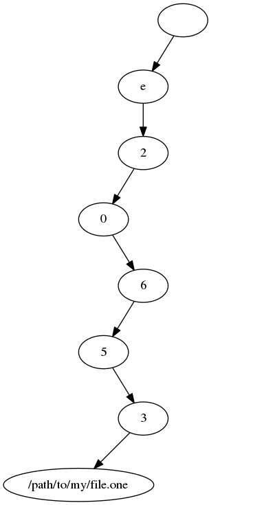
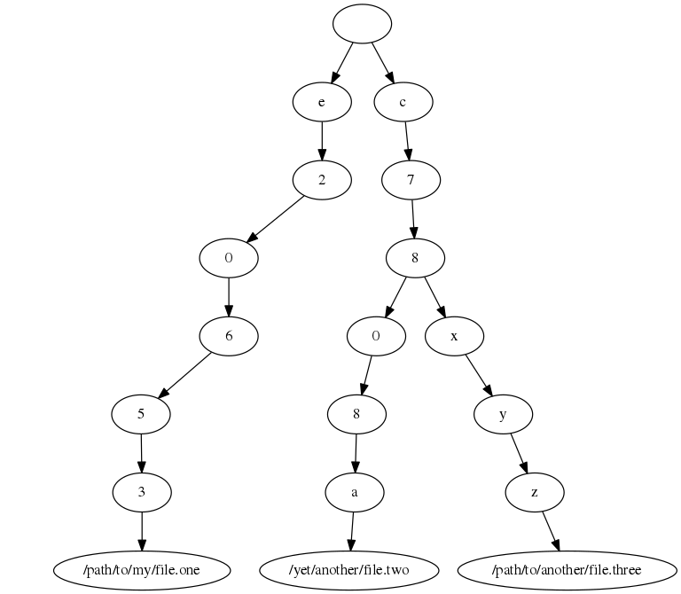
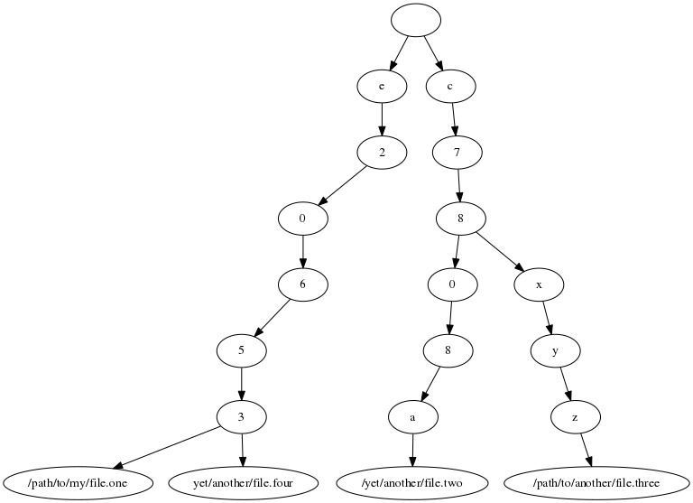

# spice
A tool to find and manage duplicate files

## How does it work?
Spice will recursively traverse the directory that the user provides and will calculate
an MD5 hash for each file that it encounters. It will store the hash in a special tree
structure, where each character of a hash is a child node, with the absolute file paths
as leaves. If a node has multiple children that are leaves, a duplicate file was found.

Consider the following example: the first file found is "/path/to/my/file.one" with the
corresponding hash value
```
e20653
```
(This hash value was chosen as an arbitrary example and is obviously not a proper
MD5 hash, as it is way to short.)

The tree that is constructed from this first file/hash pair would look like this:



Now a second file, "/yet/another/file.two", with the corresponding hash value
```
c7808a
```
and a third file, "/path/to/another/file.three", with the hash value
```
c78xyz
```
are found and added. The tree then will look like this:



At this point, no duplicates have been found yet.

Now the next file Spice encounters, "yet/another/file.four", is a duplicate of the
first file we had found before, it also has the hash value
```
e20653
```
After inserting it, the tree will now contain a node that has two leaves as children:



Traversing the directory structure and building the tree is done in *O*(n log n). When
Spice has finished its traversal, it will simply identify all those nodes with more
than one leaf as child, which is also done in *O*(n log n).

## How to build it
Install [OPAM](https://opam.ocaml.org/doc/Install.html), on Debian run:
```bash
# apt-get install opam
```
Then install dune and Jane Street's base libraries via OPAM by running:
```bash
$ opam install dune base stdio
```
Clone or download this repository, and build by running
```bash
$ dune build src/spice.exe
```
